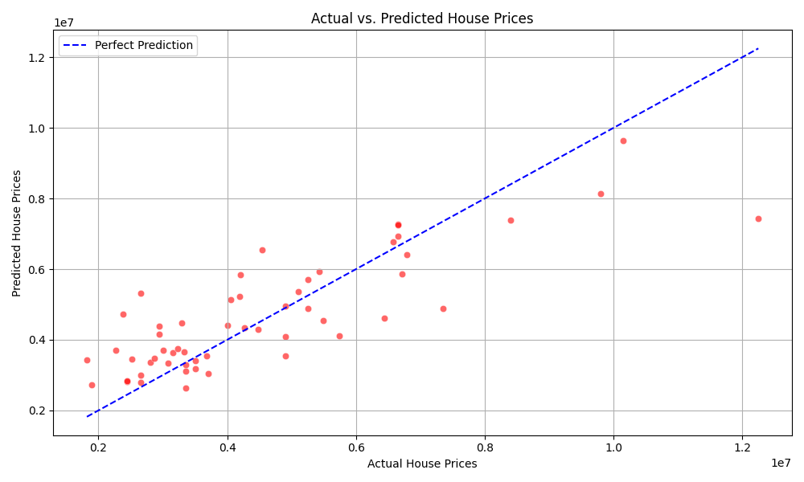

# 🏠 House Price Prediction using Linear Regression

This project predicts house prices based on features like area, number of bedrooms, bathrooms, furnishing status, and more. It uses a simple linear regression model and visualizes how well the predictions match actual prices.

---

## 📂 Dataset

- Source: [Housing Price Prediction Dataset on Kaggle](https://www.kaggle.com/datasets/harishkumardatalab/housing-price-prediction)
- Format: CSV
- Target variable: `price`
- Features include:
  - `area`, `bedrooms`, `bathrooms`, `stories`
  - Binary columns like `guestroom`, `basement`, `hotwaterheating`, `airconditioning`, `prefarea`
  - Categorical column: `furnishingstatus`

---

## 🧪 Workflow Overview

1. **Data Preprocessing**
   - Converted `'yes'`/`'no'` to `1`/`0`
   - Mapped `furnishingstatus` to ordinal values
   - Verified all columns are numeric

2. **Model Training**
   - Used `LinearRegression` from `sklearn`
   - Split data into training and test sets (90/10)

3. **Evaluation Metrics**
   - **MAE** (Mean Absolute Error)
   - **MSE** (Mean Squared Error)
   - **RMSE** (Root Mean Squared Error)
   - **R² Score** (Explained variance)

4. **Visualization**
   - Scatter plot of actual vs predicted prices
   - Diagonal line shows perfect prediction reference

---

## 📊 Sample Output
    - mae - 884725.71
    - mse - 1481693327820.21
    - rmse - 1217248.26
    - r2 score - 0.68


---

## 📈 Visualization

  
*Red dots = predictions, Blue dashed line = perfect prediction*

---

## 🛠️ Technologies Used

- Python
- Pandas
- Matplotlib & Seaborn
- Scikit-learn

---

## 🚀 How to Run

```bash
# Clone the repo
git clone https://github.com/umarbasha-ai/HOUSE-PRICE-PREDICTION-PROJECT

# Navigate to project folder
cd HOUSE-PRICE-PREDICTION-PROJECT

# Run the script
python src/house_price_prediction.py

HOUSE PRICE PREDICTION PROJECT/
│
├── DATASET/
│   └── Housing.csv
│
├── src/
│   └── house_price_prediction.py
│
├── preview.png
└── README.md